<p align="center">
  
</p>

<p align="center">
  <a href="https://www.npmjs.com/package/@blakaa/kinkin-editor"></a>
  <a href="../LICENSE"></a>
  <a href="https://react.dev"></a>
  <a href="https://tiptap.dev"></a>
</p>

<p align="center">
  <strong>语言:</strong>
  <a href="../README.md">English</a> ·
  <a href="README.vi.md">Tiếng Việt</a> ·
  简体中文 ·
  <a href="README.ja.md">日本語</a> ·
  <a href="README.ko.md">한국어</a> ·
  <a href="README.es.md">Español</a> ·
  <a href="README.pt-BR.md">Português (Brasil)</a> ·
  <a href="README.fr.md">Français</a> ·
  <a href="README.de.md">Deutsch</a>
</p>

# Kinkin Editor

**一个开箱即用的 React 富文本编辑器。** 基于 [Tiptap](https://tiptap.dev) 和
ProseMirror 构建的 Notion 风格所见即所得编辑器：markdown 进、markdown 出（也支持
HTML/JSON），内置斜杠命令、表格、图片、表情、拖拽重排区块、目录，以及一个可以对接
任意 LLM 的流式 AI Assist 面板。

```bash
npm install @blakaa/kinkin-editor
```

它的设计目标是直接放进你现有的 React 应用：没有全局 CSS reset，不要求你配置
Tailwind，没有需要挂载的 provider，也不对后端做任何假设 —— 图片上传和 AI 都只是你
自己提供的普通回调函数，不需要也可以不传。

**[在线演示与 Playground →](https://blakaalab.github.io/kinkin-editor/)** ·
[安装指南](https://blakaalab.github.io/kinkin-editor/#/docs) ·
[版本发布](https://github.com/blakaalab/kinkin-editor/releases)

---

## 功能特性

**斜杠菜单**（输入 `/`）：段落、标题 1–4、无序列表、有序列表、任务列表、引用、
代码、表情、表格、图片、分割线。

**其他内置能力**

- markdown 进、markdown 出 —— 直接粘贴 markdown 即可转换为富文本内容
- 输入 `:` 唤出表情选择器
- 每个区块都有拖拽手柄用于重排；`Mod-Shift-↑/↓` 移动，`Mod-Shift-D` 复制
- 表格支持行/列控制与拖拽重排
- 链接编辑、代码块、任务列表、高亮、排版符号替换
- 通过你提供的回调实现图片上传
- 流式 AI Assist —— 润色、续写、总结、修正语法、简化、缩短、扩写、翻译、调整语气，
  或自定义 prompt
- 通过 `onTocItemsChange` 生成目录
- 固定工具栏、选区浮动工具栏与移动端工具栏
- 内置 TypeScript 类型；支持 React 18 和 19

---

## 安装

```bash
npm install @blakaa/kinkin-editor    # 或者：pnpm add @blakaa/kinkin-editor
```

在 npm 7+ 和 pnpm 上这就是全部命令：两者都会读取 `peerDependencies`，自动为你安装
React 和全部 21 个 `@tiptap/*` 包 —— 你不需要一一列出。

### Yarn

Yarn **不会**自动安装 peer 依赖 —— Classic 和 Berry 都不会。你需要显式安装（用花括
号展开可以压缩成两行）：

```bash
yarn add @blakaa/kinkin-editor
yarn add react react-dom \
  @tiptap/{core,react,pm,starter-kit,extensions,markdown,suggestion,extension-emoji,extension-highlight,extension-history,extension-horizontal-rule,extension-image,extension-list,extension-mention,extension-strike,extension-table,extension-table-of-contents,extension-text-style,extension-typography,extension-unique-id,extension-drag-handle-react}
```

### 为什么要用 peer 依赖

React 和 ProseMirror 必须是**单一实例**。两份 React 会给你 "Invalid hook call"；两
份 ProseMirror 会给你 `RangeError: Invalid content` 以及 plugin key 冲突，因为
`prosemirror-model` 依赖 `instanceof` 判断和一个共享的 schema 注册表。把它们声明为
peer，正是让包管理器把它们合并成一份的手段。

每个 `@tiptap/*` peer 都锁定在 `~3.31.3` —— 也就是本库构建和测试所针对的版本。混用
不同的 Tiptap 次版本会在构建时失败，所以这个范围被刻意收窄，并且只在每次经过验证的
Tiptap 升级时整体推进。

---

## 快速开始

```tsx
import { useState } from "react";
import { FixedToolbar, RichTextEditor } from "@blakaa/kinkin-editor";
import "@blakaa/kinkin-editor/style.css";

export function Editor() {
  const [markdown, setMarkdown] = useState("# Hello\n\nStart typing.");

  return (
    <div style={{ height: "100vh" }}>
      <RichTextEditor
        initialContent={markdown}
        contentType="markdown"
        outputContentType="markdown"
        onChange={(value) => setMarkdown(value as string)}
        toolbar={<FixedToolbar />}
      />
    </div>
  );
}
```

两个最常见的坑：

1. **记得引入样式表。** 在应用中的任意位置 `import
   "@blakaa/kinkin-editor/style.css"` 一次即可。不引入的话编辑器会没有样式。
2. **给它一个高度。** 编辑器会填满其容器（`height: 100%`）。如果容器没有高度，它就
   会坍缩为零。请给父元素一个明确的高度，或者在它是 flex 子元素时设置
   `min-height: 0`。

工具栏是可选的 —— 省略 `toolbar` 就得到一个无边框的编辑器，仍然可以通过斜杠命令和
选区工具栏来操作。

---

## 与你自己的 Tailwind CSS 共存

**简短结论：无需任何配置，它不可能与你的样式冲突。**

库自带 Tailwind 通常会带来三个问题，这三个问题都已在构建阶段解决：

| 问题 | 规避方式 |
| --- | --- |
| 工具类冲突 —— 库里的 `.text-sm` 悄悄改变*你的*应用样式 | 每条规则都嵌套在 `.kinkin-editor` 之下，只在编辑器内部生效 |
| Token 泄漏 —— 库的 `--color-*` 在 `:root` 上覆盖你的主题 | `:root` 被重写为 `.kinkin-editor`；不会有任何东西落到文档根节点上 |
| 重复 preflight —— 两套基础 reset 互相打架 | 样式表构建时**不包含 preflight** |

库里的 `.text-gray-500` 和你的可以是完全不同的值，互不干扰。你甚至根本不需要
Tailwind —— 发布出来的就是普通的编译后 CSS。

通过 portal 渲染的 UI（菜单、tooltip、拖拽预览、移动端工具栏）本来会因为渲染到
`document.body` 而逃出这个作用域。它们被 portal 到一个同样带有该 class 的容器中，
通过 `getEditorPortalRoot()` 暴露出来。

---

## 主题定制

在作用域 class 上覆盖设计 token —— 它们会向下影响内部的一切：

```css
.kinkin-editor {
  --color-primary-700: #7c3aed;  /* 强调色：激活按钮、聚焦环 */
  --color-foreground: #1f2937;   /* 正文文字 */
  --color-background: #ffffff;
  --color-border: #e5e7eb;
  --color-muted-foreground: #6b7280;
  --font-sans: "Inter", system-ui, sans-serif;
}
```

编辑器*内容*的样式（代码块、表格、任务列表、引用）使用独立的 `--tt-core-*` 命名空
间，覆盖方式相同：

```css
.kinkin-editor {
  --tt-core-code-bg: #f5f5f5;
  --tt-core-table-header-bg: #fafafa;
  --tt-core-link: #2563eb;
  --tt-core-selection: #dbeafe;
}
```

---

## API 参考

### `<RichTextEditor />`

| 属性 | 类型 | 默认值 | 说明 |
| --- | --- | --- | --- |
| `initialContent` | `Content` | — | 初始内容：markdown/HTML 字符串，或 Tiptap JSON 文档。挂载后修改它会替换全部内容并清空撤销历史。 |
| `contentType` | `"markdown" \| "html" \| "json"` | `"markdown"` | 如何解析 `initialContent`。 |
| `outputContentType` | `"markdown" \| "html" \| "json" \| "text"` | `"markdown"` | `onChange` 输出的格式。 |
| `onChange` | `(value, meta?) => void` | — | 编辑时触发。`value` 是字符串，输出为 `"json"` 时是 `JSONContent`。AI 流式输出期间会被抑制。 |
| `editable` | `boolean` | `true` | `false` 表示只读渲染 —— 工具栏隐藏，内容仍可选中。 |
| `toolbar` | `ReactNode` | — | 渲染在内容上方、editor context 内部。传入 `<FixedToolbar />`。 |
| `imageUploadHandler` | `EditorImageUploadHandler` | — | 启用图片上传。省略即关闭。 |
| `streamCompletion` | `StreamCompletionFn` | — | 启用 AI Assist。省略即关闭。 |
| `aiMode` | `"assist" \| "chat"` | — | 决定选区工具栏显示哪个 AI 按钮。 |
| `onAiChatRequest` | `(message, selectedText) => void` | — | 当 `aiMode="chat"` 时由聊天按钮调用。 |
| `onTocItemsChange` | `(items) => void` | — | 标题变化时触发。传给 `<ToC />`。 |
| `editorRef` | `RefObject<Editor \| null>` | — | 访问底层 Tiptap 实例的逃生舱。 |
| `pageTitle` | `string` | — | 作为上下文加入 AI Assist 的 prompt。 |
| `placeholder` | `string` | — | 文档为空时的占位文字。 |

`onChange` 的 `meta.source` 在用户输入时为 `"manual"`，在程序化修改时为
`"conversation"` —— 便于对非用户改动跳过自动保存。

### 工具栏

| 导出 | 行为 |
| --- | --- |
| `<FixedToolbar showAiAssist? className? />` | 常驻工具栏。通过 `toolbar` 属性传入。撤销/重做、区块类型（段落、H1–H4）、列表（无序/有序/任务）、粗体/斜体/下划线/删除线/代码、引用、代码块、分割线、链接、表格、图片、斜杠触发、AI Assist。 |
| `<SelectionToolbar />` | 桌面端浮动在选中文本上方。自动渲染。 |
| `<MobileToolbar />` | 在 480px 以下停靠在底部。自动渲染。 |

只有 `FixedToolbar` 需要你手动挂载，另外两个已经接好线了。

### `<ToC />`

```tsx
const [items, setItems] = useState([]);
const editorRef = useRef(null);

<RichTextEditor editorRef={editorRef} onTocItemsChange={setItems} {...rest} />
<ToC items={items} editor={editorRef.current} trackScroll />
```

| 属性 | 类型 | 默认值 | 说明 |
| --- | --- | --- | --- |
| `items` | `TableOfContentDataItem[]` | `[]` | 来自 `onTocItemsChange`。 |
| `editor` | `Editor \| null` | — | 来自 `editorRef`。滚动到标题时需要它。 |
| `trackScroll` | `boolean` | `true` | 高亮当前视口内的标题。它监听的是 *window* 滚动，所以如果编辑器位于你自己的滚动容器中，请关闭它。 |

### `imageUploadHandler` —— 图片上传

拖入、粘贴或通过工具栏选择图片时会调用它。返回用于嵌入的 URL；抛出异常则在 UI 上标
记为上传失败。

```ts
import type { EditorImageUploadHandler } from "@blakaa/kinkin-editor";

const imageUploadHandler: EditorImageUploadHandler = {
  upload: async (file: File, onProgress: (percent: number) => void) => {
    const form = new FormData();
    form.append("file", file);

    const res = await fetch("/api/upload", { method: "POST", body: form });
    if (!res.ok) throw new Error("Upload failed");

    onProgress(100);
    return (await res.json()).url;
  },
};
```

### `streamCompletion` —— 流式 AI Assist

它驱动 AI Assist。库会根据用户选择的操作（`improve`、`continue`、`summarize`、
`fix-grammar`、`simplify`、`shorten`、`extend`、`translate`、`tone`、`custom`）加上
周围的上下文来构造 prompt。传输层由你掌控：每个 token 调用一次 `onChunk`，结束时调
用 `onComplete`，出错时调用 `onError`，并且要响应 `signal` 以便停止按钮生效。

```ts
import type { StreamCompletionFn } from "@blakaa/kinkin-editor";

const streamCompletion: StreamCompletionFn = async ({
  message,
  signal,
  onChunk,
  onComplete,
  onError,
}) => {
  try {
    const res = await fetch("/api/llm", {
      method: "POST",
      body: JSON.stringify({ prompt: message }),
      signal,
    });

    const reader = res.body!.getReader();
    const decoder = new TextDecoder();

    while (true) {
      const { done, value } = await reader.read();
      if (done) break;
      onChunk(decoder.decode(value, { stream: true }));
    }

    onComplete();
  } catch (e) {
    if (!signal?.aborted) onError(e instanceof Error ? e.message : "Failed");
  }
};
```

不传它的话，AI 按钮会变成空操作，并在控制台给出一条警告。

### 其他导出

| 导出 | 用途 |
| --- | --- |
| `useAiAssistStream(editor, options)` | AI Assist 背后的 hook，适用于你自己组装编辑器的场景。 |
| `getEditorPortalRoot()` | portal UI 渲染进入的作用域容器。 |
| `EDITOR_SCOPE_CLASS` | `"kinkin-editor"` —— 作用域 class，用于标记你自己的 portal。 |
| `<ToCItem />`、`<ToCEmptyState />` | 构成 `<ToC />` 的零件，便于你自定义大纲布局。 |
| 类型 | `RichTextEditorProps`、`EditorImageUploadHandler`、`StreamCompletionFn`、`StreamCompletionParams` |

---

## 常用写法

**自动保存，并跳过程序化修改**

```tsx
<RichTextEditor
  onChange={(value, meta) => {
    if (meta?.source === "manual") debouncedSave(value as string);
  }}
  {...rest}
/>
```

**只读预览**

```tsx
<RichTextEditor initialContent={doc} editable={false} contentType="markdown" />
```

**访问 Tiptap 实例**

```tsx
const editorRef = useRef(null);
<RichTextEditor editorRef={editorRef} {...rest} />;
// 之后：editorRef.current?.commands.focus()
```

**使用 HTML 而非 markdown**

```tsx
<RichTextEditor contentType="html" outputContentType="html" {...rest} />
```

---

## 疑难排查

### 编辑器渲染出来没有样式

你没有 `import "@blakaa/kinkin-editor/style.css"`。

### 编辑器高度为零

它会填满容器。请给父元素一个明确的高度，或者在它是 flex 子元素时设置
`min-height: 0`。

### `@tiptap/core` 重复，或 `getPreviousBlockSibling is not exported`

你的依赖树里存在多个 Tiptap 版本。Tiptap 自身传递依赖中的 `^3.31.3` 范围可能解析到
更新的次版本，从而引入第二份 `@tiptap/core`。请在应用的 `package.json` 中锁定整个
scope：

```json
{
  "overrides": {
    "@tiptap/core": "3.31.3",
    "@tiptap/pm": "3.31.3"
  }
}
```

（Yarn 里叫 `resolutions`。）升级时请整个 scope 一起动 —— 混用 Tiptap 次版本会在构
建时失败，而不是运行时。

### 菜单或 tooltip 没有样式

有东西把它们渲染到了作用域容器之外。请把它们 portal 到 `getEditorPortalRoot()`。

### 加了编辑器之后我的应用样式变了

不应该发生 —— 作用域隔离正是为了防止这一点。如果真的发生了，这是一个值得上报的
bug。

---

## 许可证

[MIT](../LICENSE)。随意使用、fork、商用 —— 保留版权声明即可。

---

## 本地开发

目录结构、代码规范和构建说明请见英文 README 的
[Local development](../README.md#local-development) 一节。
